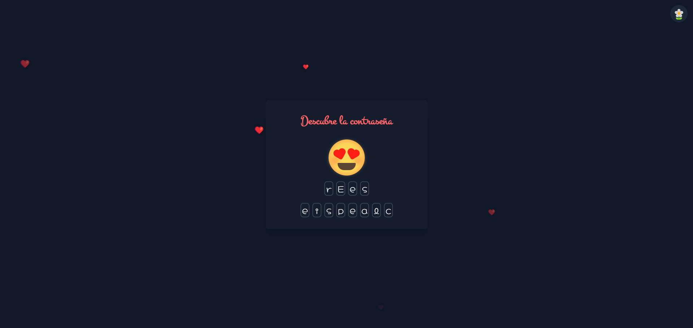
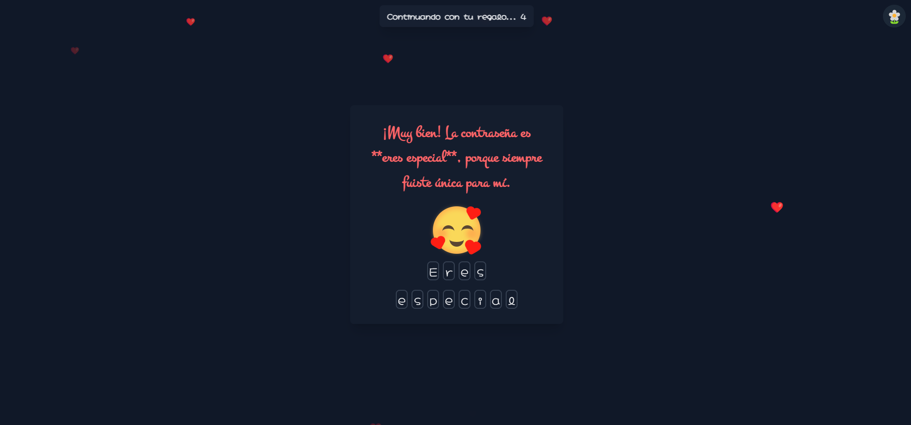
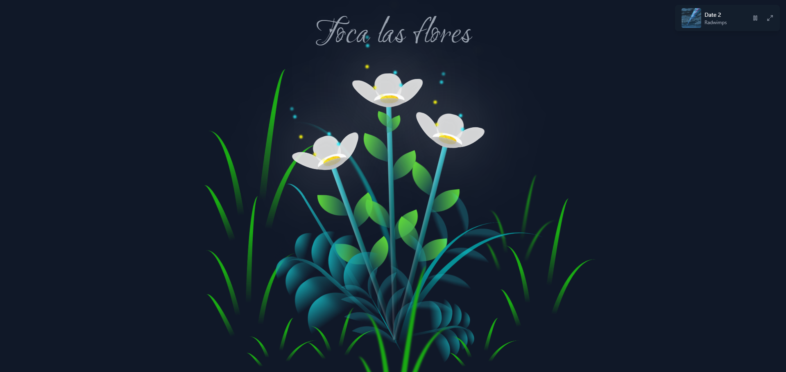
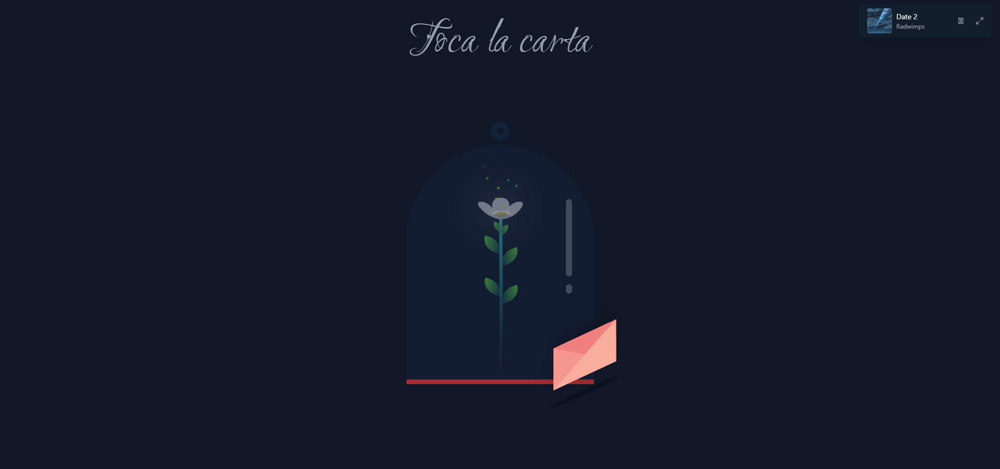
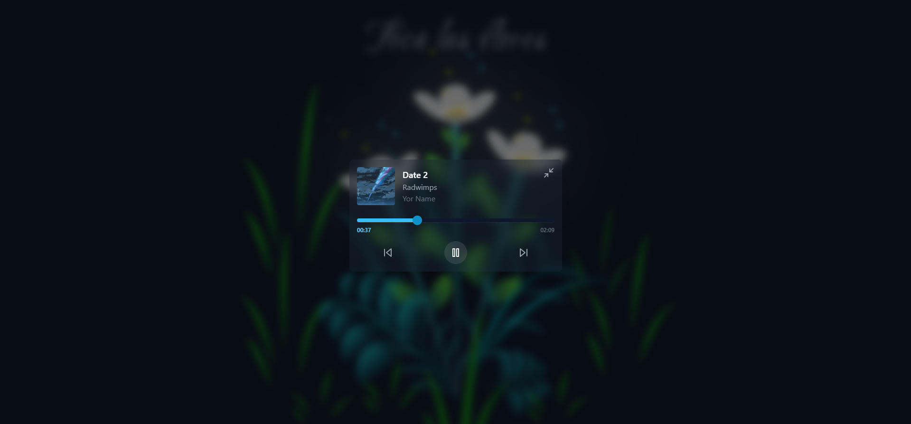
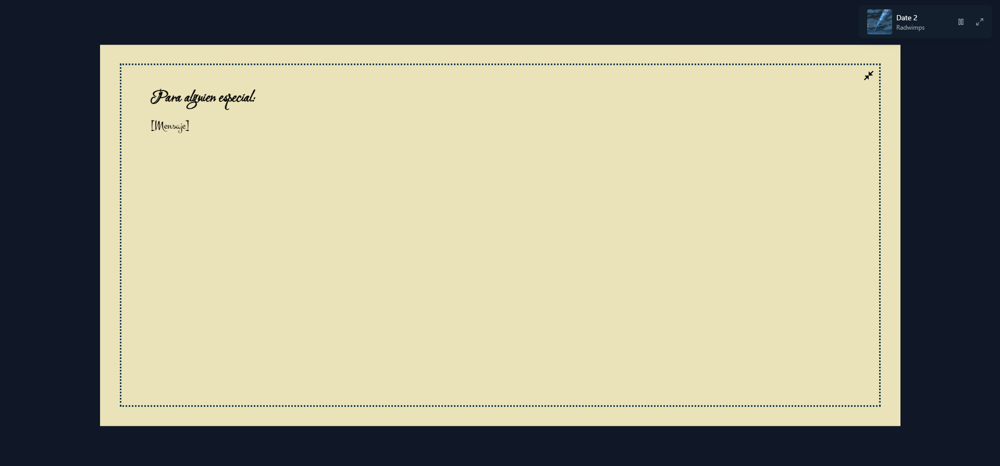

# Unas Palabras para Ti 🌹

Este proyecto es una página web interactiva creada como un regalo especial para alguien muy importante. Combina elementos visuales, animaciones y música para transmitir un mensaje sincero y emotivo.

---

## Características principales ✨

- **Animaciones personalizadas**: Flores que crecen, una carta que se abre y más.
- **Reproductor de música integrado**: Con canciones seleccionadas especialmente de artistas como Radwimps, Ed Sheeran y más.
- **Interactividad**: El usuario puede interactuar con la página para descubrir mensajes ocultos.
- **Diseño responsive**: Funciona en dispositivos móviles y de escritorio.
- **Tema claro/oscuro**: Adaptable a las preferencias del usuario.
- **Modelos 3D**: Un corazón que se mueve y gira, junto con un cuerpo que entrega el corazón.

---

## Capturas de pantalla 📸













---

## Estructura del proyecto 📂

```plaintext
alba2809-valentines-present/
├── README.md
├── index.html
├── package.json
├── public/
│   ├── images/
│   │   ├── Date 2.webp
│   │   ├── Eve.webp
│   │   ├── I wont give up.webp
│   │   ├── La Bestia.webp
│   │   ├── Mala Maña.webp
│   │   ├── Nandemonaiya.webp
│   │   ├── One Summers Day.webp
│   │   └── Perfect.webp
│   └── music/
│       ├── Date 2.ogg
│       ├── Eve.ogg
│       ├── I wont give up.ogg
│       ├── La Bestia.ogg
│       ├── Mala Maña.ogg
│       ├── Nandemonaiya.ogg
│       ├── One Summers Day.ogg
│       └── Perfect.ogg
└── src/
    ├── App.jsx
    ├── index.css
    ├── main.jsx
    ├── assets/
    │   └── fonts/
    │       └── Kiss Me Quick.ttf
    ├── components/
    │   ├── AnimatedFace.jsx
    │   ├── AudioPlayer.jsx
    │   ├── Slider.jsx
    │   ├── ThemeToggle.jsx
    │   ├── AuthPage/
    │   │   ├── Decorations.jsx
    │   │   ├── InputLetter.jsx
    │   │   ├── MessageHelp.jsx
    │   │   ├── MessageTimer.jsx
    │   │   └── ReorderWord.jsx
    │   ├── FlowerPage/
    │   │   ├── AnimatedCard.jsx
    │   │   ├── CardDialog.jsx
    │   │   ├── GlassFlower.jsx
    │   │   ├── MainFlower.jsx
    │   │   ├── SecondaryFlowers.jsx
    │   │   └── ValentineCard.jsx
    │   └── styles/
    │       ├── AnimatedFace.css
    │       ├── Arrow.css
    │       ├── FlowerAnimated.css
    │       ├── Slider.css
    │       └── ValentineCard.css
    ├── data/
    │   ├── musics.json
    │   └── passwords.json
    ├── hooks/
    │   └── useAudioPlayer.js
    └── pages/
        ├── Auth.jsx
        ├── Flower.jsx
        ├── Loading.jsx
        ├── Test.jsx
        └── VerifyAuth.jsx
  ```

---

## Tecnologías utilizadas 🛠️

- **React**: Biblioteca principal para la construcción de la interfaz.
- **Vite**: Herramienta de construcción rápida.
- **Tailwind CSS**: Para estilos personalizados y responsive.
- **Framer Motion**: Para animaciones fluidas y dinámicas.
- **React Router**: Para la navegación entre páginas.
- **React Icons**: Para íconos visuales.
- **Three.js**: Biblioteca para crear modelos 3D.
- **GSAP**: Animación de GSAP para crear animaciones.
- **React Three Fiber**: Biblioteca para crear modelos 3D.
- **React Three Postprocessing**: Biblioteca para crear efectos visuales.
- **React Three Drei**: Biblioteca para crear modelos 3D.

---

## Cómo ejecutar el proyecto 🚀

1. Clona el repositorio:
   ```bash
   git clone https://github.com/Alba2809/valentines-present
   ```
   
2. Instala las dependencias:
   ```bash
   npm install
   ```
      
3. Crea el archivo .env y agrega el texto para la carta.
   
4. Ejecuta el servidor de desarrollo:
   ```bash
   npm run dev
   ```
   
5. Abre tu navegador y visita:
   ```bash
   http://localhost:5173/
   ```

---

## Despliegue 🌐

El proyecto está configurado para desplegarse en Vercel. [Ir a la web](https://a-present-for-you.vercel.app/)

---

## Modelos 3D 🎨

Modelos base obtenidos de [SketchFab](https://sketchfab.com). Los modelos fueron modificados para que se ajustaran a lo deseado, desde el tamaño, la forma y animaciones.

- **Cuerpo base**: This work is based on ["Male base mesh"](https://sketchfab.com/3d-models/male-base-mesh-427fc72a505140abbd56451d692a3734) by [bhagath2005](https://sketchfab.com/bhagath2005) licensed under [CC-BY-4.0](http://creativecommons.org/licenses/by/4.0/)
- **Corazón**: This work is based on ["PUMPING HEART MODEL"](https://sketchfab.com/3d-models/pumping-heart-model-6f815b9822dc479eae0a17b8dcab9c75) by [omarelone](https://sketchfab.com/omarelone) licensed under [CC-BY-4.0](http://creativecommons.org/licenses/by/4.0/)
